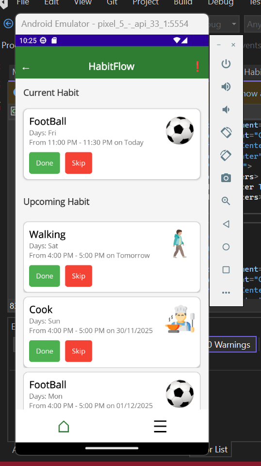
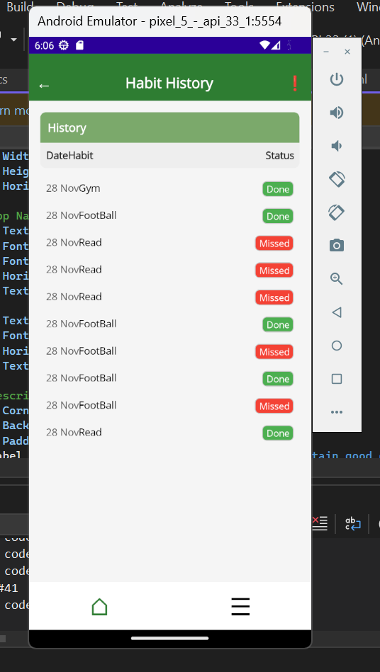
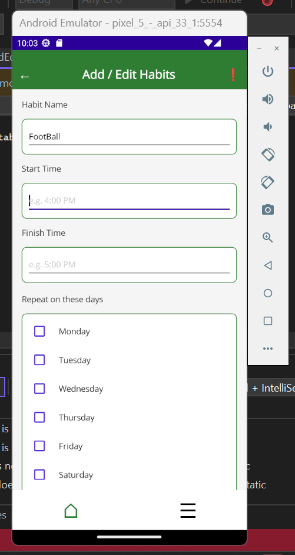
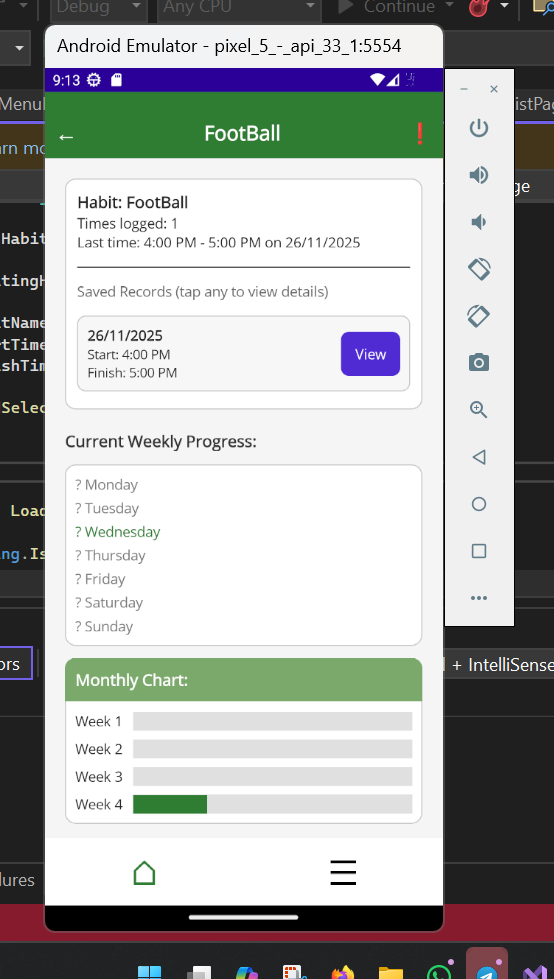

# HabitFlow App

A modern mobile habit tracking application built using **.NET MAUI** to help users build and maintain daily routines.

---

## 📱 Features

* ✅ Add and manage daily habits
* 📊 Track habit completion
* 📈 View progress details (weekly & monthly)
* 🗂 Habit categories (gym, reading, etc.)
* 🔔 Simple and user-friendly UI

---

## 🛠️ Technologies Used

* .NET MAUI
* C#
* XAML
* SQLite (local database)

---

## 🚀 How to Run

1. Open the project in **Visual Studio 2022**
2. Select **Android Emulator / Windows Machine**
3. Click **Run ▶️**

---

## 📸 Screenshots

### 🏠 Home Screen

### 📊 Habit History

### ➕ Add / Edit Habit

### 📈 Progress Details

---

## 📂 Project Structure

* `Models/` → Data models
* `Data/` → Database logic
* `Resources/` → Images, fonts, styles
* `Platforms/` → Android, iOS configurations
* `.xaml pages` → UI screens

---

## 👨‍💻 Author

**Amr Almahmodi**
Software Engineering Student @ UNITEN

---

## ⭐ Notes

This project was developed as part of a mobile application development course and demonstrates practical skills in cross-platform app development using .NET MAUI.
